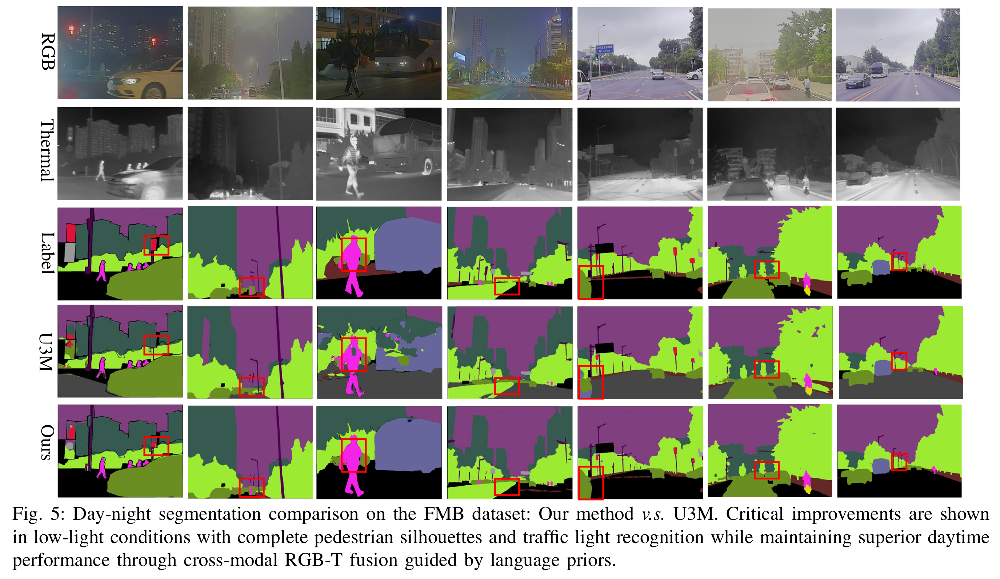

## Unveiling the Potential of Segment Anything Model 2 for RGB-Thermal Semantic Segmentation with Language Guidance

[](https://paperswithcode.com/sota/thermal-image-segmentation-on-pst900?p=unveiling-the-potential-of-segment-anything)


SHIFNet is an innovative SAM2-driven Hybrid Interactive Fusion Paradigm designed for RGB-T perception tasks. This framework fully unlocks the potential of SAM2 through language-guided adaptation, effectively mitigating its inherent RGB bias and enhancing cross-modal semantic consistency. SHIFNet consists of two key components: (1) Semantic-Aware Cross-modal Fusion (SACF) module, which dynamically balances modality contributions through text-guided affinity learning, enabling adaptive cross-modal information integration; (2) Heterogeneous Prompting Decoder (HPD), which enhances global semantic understanding through a semantic enhancement module and category embeddings, ensuring cross-modal semantic consistency. With only 32.27M trainable parameters, SHIFNet achieves 89.8%, 67.8%, and 59.2% mIoU on PST900, FMB, and MFNet benchmarks, respectively, while attaining 76.5% pedestrian detection accuracy in safety-critical scenarios. By reducing the cost of large-scale data collection and enhancing multi-modal perception capabilities, SHIFNet provides a reliable perception foundation for intelligent robotic systems operating in complex environments.

## Training
# Dataset Preparation

Ensure the dataset directory is structured as follows:
```
data/
├── FMB
│   ├── train
│   └── test
└── PST900
    ├── train
    └── test
```
Set the -data_path parameter to correspond to these folders when training.
# Environment Setup

1) Create Conda Environment
```conda create --name SHIFNet python=3.12.3```
```conda activate SHIFNet```

2) Install SAM2
Please install SAM2 following the official documentation.

3) Install Required Dependencies
```pip install tensorboardX matplotlib einops monai tabulate fvcore opencv-python addict yapf rich```
```pip install scikit-learn simple_parsing requests```
```pip install mmcv==2.2.0 -f https://download.openmmlab.com/mmcv/dist/cu121/torch2.4/index.html```

4.Category Embedding
| Method              | Description                                               |
| ------------------- | --------------------------------------------------------- |
| LanguageBind        | Encode class semantic vectors via LanguageBind            |
| Provided Embeddings | Use our precomputed vectors (recommended for quick start) |

5.Example command for single-GPU training:
```
python -m torch.distributed.launch --nproc_per_node=1 --use_env --master_port=30000 multigpu_train.py \
    -ms l \
    -dataset fmb \
    -distributed "0" \
    -data_path data/FMB \
    -gpu_device 0 \
    -b 1 \
    -lr 1e-4 \
    -ddp True \
    -label_path data/FMB/fmb_class_embedding.pt
```
6.Pretrained Weights & Embeddings
| Resource                          | Download                                                                                                             |
| --------------------------------- | -------------------------------------------------------------------------------------------------------------------- |
| Best checkpoints for FMB & PST900 | [https://pan.baidu.com/s/155ZzxPhHTbGCGN0q_OneDA?pwd=kkyc](https://pan.baidu.com/s/155ZzxPhHTbGCGN0q_OneDA?pwd=kkyc) |
| Text Embeddings (.pt)             | Included in download package                                                                                         |

# Visualization
```python vis.py```
Example visualization output on FMB dataset:
<p align="center">  <br> <em>Visualization examples on the FMB dataset</em> </p>

## 🤝 Publication:
Please consider referencing this paper if you use the ```code``` from our work.
Thanks a lot :)

```
@article{zhao2025unveiling,
  title={Unveiling the Potential of Segment Anything Model 2 for RGB-Thermal Semantic Segmentation with Language Guidance},
  author={Zhao, Jiayi and Teng, Fei and Luo, Kai and Zhao, Guoqiang and Li, Zhiyong and Zheng, Xu and Yang, Kailun},
  journal={arXiv preprint arXiv:2503.02581},
  year={2025}
}
```
